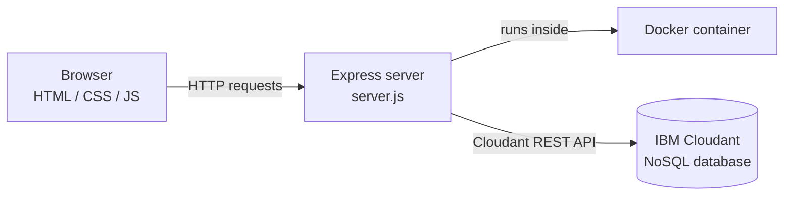

# ☁️ Cloud-Powered Task Manager

A full-stack CRUD web application for managing tasks, backed by **IBM Cloudant** — a managed NoSQL document database on IBM Cloud — and packaged with **Docker** for consistent, portable deployment.

> Built as a PBEL (Project-Based Experiential Learning) submission for IBM Cloud Computing.


---

## What this is

Every task in this app is stored as a **JSON document** in IBM Cloudant — not a row in a table. The UI is deliberately designed around that fact: each task shows its own document ID and revision number, and a live "sync strip" at the top reports the real-time connection state straight from the database.

The app runs identically whether you start it with plain `node server.js` or inside a Docker container, and automatically falls back to an in-memory store when Cloudant credentials aren't configured — so it's always runnable, with or without cloud access.

## Architecture



- **Frontend:** Vanilla HTML/CSS/JS — no framework, no build step
- **Backend:** Node.js + Express, exposing a small REST API
- **Database:** IBM Cloudant, accessed via the official `@ibm-cloud/cloudant` SDK
- **Containerization:** Docker + Docker Compose

## Features

- Full CRUD — create, read, update (title, priority, complete), and delete tasks
- **Live sync strip** — real-time connection status, active database name, and document count, sourced from `/api/health`
- **Priority levels** (low / medium / high) with color-coded task borders
- **Search + filter tabs** (All / Active / Completed) with live counts
- **Idempotent bulk-seed** (`POST /api/tasks/seed`) — inserts 5 sample tasks via Cloudant's `postBulkDocs` API; safe to click repeatedly, never creates duplicates
- **Clear-all** endpoint/button for quickly resetting demo data
- Each task displays its Cloudant document ID and revision number — the document model made visible, not hidden
- Graceful in-memory fallback — runs with zero cloud setup for local development
- Dockerized for identical behavior across machines

## Tech stack

| Layer | Technology |
|---|---|
| Frontend | HTML5, CSS3, vanilla JavaScript |
| Backend | Node.js, Express |
| Database | IBM Cloudant (NoSQL / CouchDB-compatible document store) |
| SDK | `@ibm-cloud/cloudant` (official IBM Cloud SDK) |
| Containerization | Docker, Docker Compose |
| Typography | IBM Plex Sans / IBM Plex Mono |

## Getting started

### Run locally (no cloud account needed)

```bash
npm install
npm start
```

Visit `http://localhost:3000`. Runs in in-memory mode until Cloudant credentials are provided.

### Connect to IBM Cloudant

1. Go to [IBM Cloud](https://cloud.ibm.com/) → Catalog → search **Cloudant** → create a resource on the **Lite plan** (free)
2. Open the resource → **Service credentials** → **New credential** → **Create**
3. Copy the `url` and `apikey` fields
4. Copy `.env.example` to `.env` and fill in:
   ```
   CLOUDANT_URL=https://<your-instance-id>-bluemix.cloudantnosqldb.appdomain.cloud
   CLOUDANT_APIKEY=<your-api-key>
   CLOUDANT_AUTH_TYPE=iam
   ```
5. Restart the app — the console will print `Storage backend: IBM Cloudant`, and the `tasks` database is created automatically on first run

### Run with Docker

```bash
docker compose up --build
```

or manually:

```bash
docker build -t cloud-task-manager .
docker run -p 3000:3000 --env-file .env cloud-task-manager
```

## API reference

| Method | Route | Description |
|---|---|---|
| GET | `/api/health` | Storage backend, active database, and document count |
| GET | `/api/tasks` | List all tasks |
| POST | `/api/tasks` | Create a task — `{ "title", "priority"? }` |
| POST | `/api/tasks/seed` | Idempotent bulk-insert of 5 sample tasks |
| PUT | `/api/tasks/:id` | Update a task — `{ "title"?, "done"?, "priority"? }` |
| DELETE | `/api/tasks/:id` | Delete a single task |
| DELETE | `/api/tasks` | Delete every task |

## Project structure

```
cloud-task-manager/
├── server.js            # Express app + Cloudant integration
├── public/               # Frontend
│   ├── index.html
│   ├── style.css
│   └── app.js
├── Dockerfile
├── docker-compose.yml
├── .env.example
├── package.json
└── README.md
```

## How this satisfies the project brief

| Requirement | How it's met |
|---|---|
| CRUD web app | Full create/read/update/delete on tasks |
| IBM Cloudant NoSQL database | Live integration via `@ibm-cloud/cloudant`, verified working (see screenshots) |
| Docker | `Dockerfile` + `docker-compose.yml`, verified running via `docker ps` |
| From-scratch build | No template/boilerplate — backend, frontend, and infra written for this project |

## Screenshots

_Add these three images to an `assets/` folder in this repo and reference them here:_

1. App UI showing `cloudant:connected` in the sync strip
2. Terminal output showing `docker compose up --build` completing with `Storage backend: IBM Cloudant`
3. `docker ps` output showing the container running with port `3000` mapped

## License

MIT — free to use and adapt.

---

---

<div align="center">

**Developed by Abdul Samad**

*AI & Machine Learning · Full-Stack Development*

[](https://github.com/abdul-samad-001)

</div>
